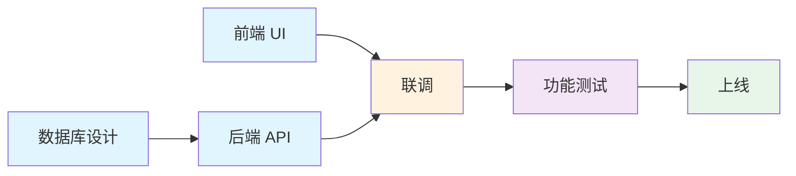

# Project Manager

覆盖完整项目周期的项目管理技能 — 从需求输入到交付复盘。

## 核心工作流

```
需求输入 → 理解拆解 → 任务编排 → 过程管理 → 测试验收 → 上线复盘
```

## Phase 1: 需求理解与拆解

### 需求接收清单

收到需求后，首先确认以下内容是否完备：

- [ ] 需求文档（PRD）是否完备，逻辑是否自洽
- [ ] 原型 / 设计稿是否到位，是否有标注
- [ ] 验收标准是否明确、可衡量
- [ ] 边界条件、异常场景是否覆盖
- [ ] 是否有依赖其他系统 / 团队
- [ ] 是否有性能、安全等非功能需求

### WBS 拆解（Work Breakdown Structure）

将每个需求拆解到 **可执行的任务粒度**（1-2 天 / 人）：

```
功能：订单列表
├── 前端：列表页 UI（1d）
├── 前端：筛选条件组件（0.5d）
├── 前端：分页组件（0.5d）
├── 后端：订单列表 API（1d）
├── 后端：筛选与排序逻辑（0.5d）
├── 后端：分页参数处理（0.5d）
├── 测试：功能用例编写与执行（0.5d）
└── 测试：异常场景覆盖（0.5d）
```

### 工作量估算方法

| 方法     | 适用场景       | 说明                                     |
| -------- | -------------- | ---------------------------------------- |
| 类比估算 | 有类似历史项目 | 参考历史项目实际工时                     |
| 三点估算 | 不确定性高     | O + 4M + P / 6（乐观 + 4×最可能 + 悲观） |
| 专家判断 | 新技术/领域    | 咨询有经验的工程师                       |
| 分解估算 | 需求明确       | 逐层分解后汇总                           |

## Phase 2: 任务编排与排期

### 依赖分析与关键路径

1. 识别任务间的依赖关系（前置/后置/并行）
2. 画出任务网络图，找出关键路径（最长的依赖链）
3. 关键路径上的任务 **优先保障资源**，不可延期
4. 非关键路径任务可灵活调整，利用浮动时间



### 优先级矩阵（Eisenhower Matrix）

```
                 紧急                   不紧急
    重要  ┌───────────────┬────────────────┐
          │  P0          │  P1             │
          │  立即执行     │  排入计划       │
          │  阻塞项/故障  │  核心功能优化   │
          ├───────────────┼────────────────┤
    不重要 │  P2          │  P3             │
          │  委托他人     │  低优先级       │
          │  日常运维     │  技术债/文档    │
          └───────────────┴────────────────┘
```

### 里程碑设置

| 里程碑           | 产出              | 评审要点                 |
| :--------------- | :---------------- | :----------------------- |
| M1: 核心功能完成 | 前后端开发完成    | Demo 演示，确认功能完整  |
| M2: 联调完成     | 前后端联调通过    | 全流程走通，异常场景覆盖 |
| M3: 测试完成     | 功能/回归测试通过 | Bug 率达标，遗留问题确认 |
| M4: 上线发布     | 生产环境部署      | 上线检查清单全部完成     |

### 排期表示例

```markdown
| 任务         | 负责人    | 估时 |   依赖   | 开始 | 结束 |
| :----------- | :-------- | :--: | :------: | :--: | :--: |
| 数据库表设计 | 张三      |  1d  |    —     | 6/1  | 6/1  |
| 订单列表 API | 张三      |  2d  | DB 设计  | 6/2  | 6/3  |
| 列表页 UI    | 李四      | 1.5d |    —     | 6/2  | 6/3  |
| 前后端联调   | 张三/李四 |  1d  | API + UI | 6/4  | 6/4  |
```

## Phase 3: 过程管理

### 每日站会

```
1. 昨天完成了什么？
2. 今天计划做什么？
3. 有什么阻塞需要协调？
```

**要点**：聚焦同步，解决问题在会后，站会不超过 15 分钟。

### 进度监控方式

| 频率   | 活动                | 产出                 |
| :----- | :------------------ | :------------------- |
| 每日   | 站会同步            | 了解进度与阻塞       |
| 每周   | 进度看板更新 + 周报 | 整体进展 vs 计划     |
| 里程碑 | 阶段评审            | 确认是否达到门禁标准 |

### 风险跟踪表

```markdown
| 风险描述               | 等级 | 概率 | 影响 | 应对方案                     | 负责人 |
| :--------------------- | :--: | :--: | :--: | :--------------------------- | :----- |
| 第三方支付接口延迟提供 |  高  |  中  |  高  | 提前 mock 联调，准备备选方案 | 张三   |
| 设计师请假导致 UI 阻塞 |  中  |  低  |  中  | 优先出核心页面，提前沟通排期 | 李四   |
| 性能不达标             |  中  |  中  |  高  | 早期做压测，预留优化 buffer  | 王五   |
```

### 变更管理流程

```
变更请求 → 评估影响(范围/时间/成本) → 确认是否接受 → 更新计划 → 通知相关方
```

### 阻塞升级路径

```
个人无法解决 → 反馈 Tech Lead → 项目经理协调 → 上级决策
```

## Phase 4: 测试与验收

### 测试阶段流程

```
开发自测 → 联调测试 → 功能测试 → 回归测试 → UAT 验收
```

### Bug 分级标准

| 级别    | 定义                       | 响应时间   | 处理方式               |
| :------ | :------------------------- | :--------- | :--------------------- |
| P0 阻塞 | 核心功能不可用，无替代方案 | 立即修复   | 停止其他工作，全力修复 |
| P1 严重 | 功能异常但有替代方案       | 当天修复   | 当天 fix，不影响发布   |
| P2 一般 | 体验问题，不影响功能       | 版本内修复 | 排入迭代               |
| P3 建议 | 优化建议                   | 后续版本   | 记录待后续评估         |

### 验收标准示例

```gherkin
Feature: 订单列表
  Scenario: 正常查看订单列表
    Given 用户已登录
    When 用户访问订单列表页
    Then 显示最近 20 条订单
    And 每条订单包含订单号、金额、状态、时间

  Scenario: 筛选订单状态
    Given 用户已登录
    When 用户选择"已完成"状态筛选
    Then 只显示已完成订单
```

## Phase 5: 上线与复盘

### 上线检查清单

- [ ] 功能测试通过（P0/P1 无未关闭 bug）
- [ ] 回归测试通过
- [ ] 性能测试达标（响应时间 / QPS / 资源使用）
- [ ] 安全扫描通过
- [ ] 上线 / 回滚方案已确认
- [ ] 数据库变更脚本已准备
- [ ] 监控告警已配置
- [ ] 线上日志已配置
- [ ] 相关方（客服 / 运营）已通知
- [ ] 上线窗口已确认

### 回滚方案模板

```markdown
## 回滚触发条件

- 核心接口错误率 > 1%
- 响应时间超过基线的 2 倍
- 关键功能不可用

## 回滚步骤

1. 执行部署回滚：`git revert <commit>`
2. 数据库回滚（如有）：`prisma migrate down`
3. 验证回滚后服务正常
4. 通知相关方
```

### 项目复盘框架

```
What went well?    → 识别有效实践，继续保持
What went wrong?   → 分析根因（5 Whys），避免重犯
What to improve?   → 制定可落地的改进措施
```

**复盘产出**：

- 项目复盘报告（含数据）
- 改进措施清单（指定负责人和截止时间）
- 知识沉淀（文档 / 自动化工具）

## 沟通管理

### 沟通计划

| 沟通对象   | 频率   | 方式   | 内容               |
| :--------- | :----- | :----- | :----------------- |
| 项目团队   | 每日   | 站会   | 进度同步、阻塞     |
| 产品经理   | 每周   | 周会   | 需求变更、进度对齐 |
| 技术负责人 | 按需   | 1 on 1 | 技术方案、风险评估 |
| 管理层     | 里程碑 | 汇报   | 整体进展、关键决策 |

### 跨团队协作原则

1. **明确接口人**：每个团队指定一个对接人
2. **书面确认**：跨团队承诺通过文档/IM 确认，避免口头传递
3. **提前暴露依赖**：及时同步依赖项和时间节点
4. **共建排期**：涉及多团队的任务联合排期

## 常用工具与模板

### 项目状态报告模板

```markdown
# 项目状态报告 - {项目名}

日期：YYYY-MM-DD

## 整体状态

🟢 正常 / 🟡 有风险 / 🔴 阻塞

## 本轮完成

- 功能 A 开发完成
- 功能 B 进入测试

## 下轮计划

- 功能 B 测试完成
- 功能 C 开始开发

## 风险与阻塞

- xxx：需要产品确认（影响排期中）

## 需要支持

- 需要服务器资源扩容
```

## 代码审查检查项

- [ ] 需求是否已完成 WBS 拆解到可执行粒度
- [ ] 是否识别了关键路径和依赖关系
- [ ] 是否设置了明确的里程碑和门禁标准
- [ ] 风险是否已识别并制定应对方案
- [ ] 上线检查清单是否完整
- [ ] 回滚方案是否已准备
- [ ] 相关方沟通计划是否到位
